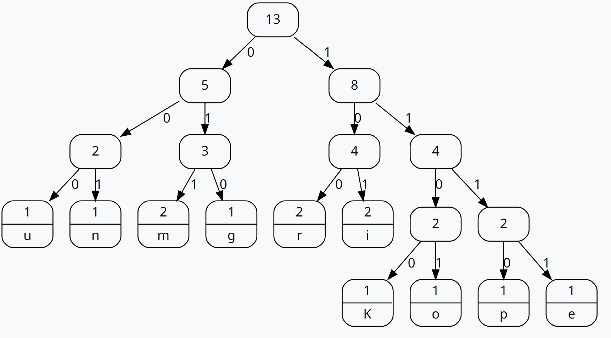
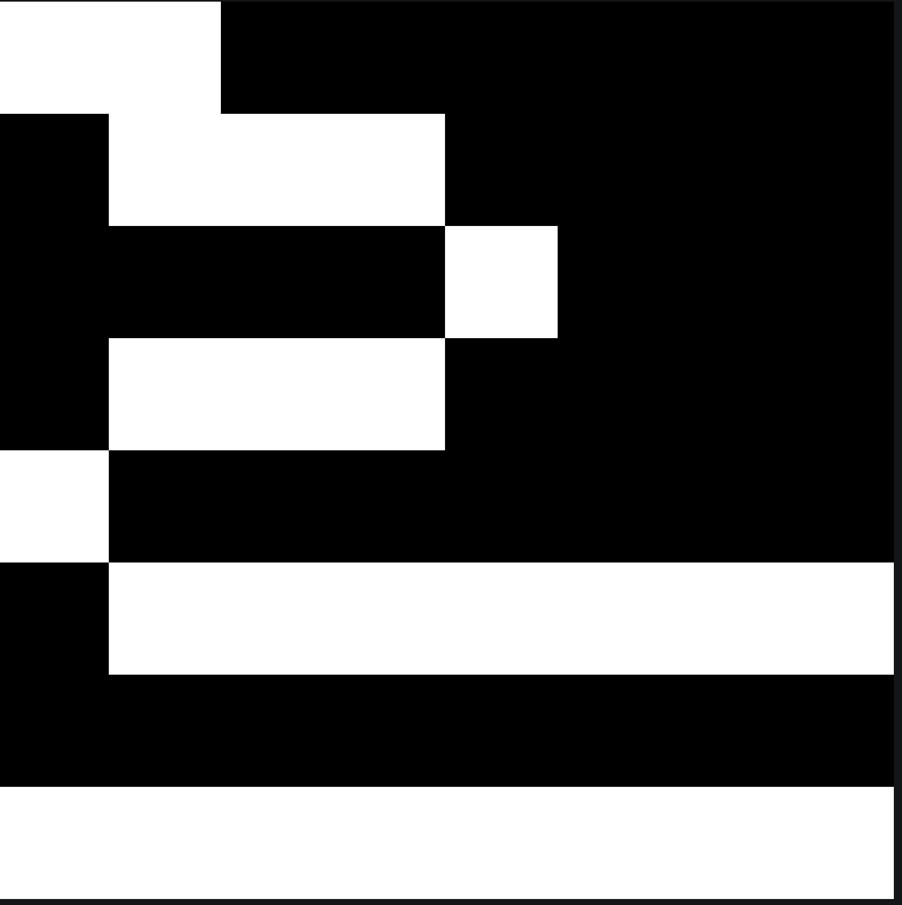

# Aufgabe 

## 1
Ein binärer Baum ist eine spezielle Art von Baumstruktur, bei dem jeder Knoten höchstens zwei Kindknoten hat. Ein nicht-binärer Baum hingegen kann mehr als zwei Kindknoten pro Knoten haben.
## 2
Hier ist ein Beispiel für einen Huffman-Code für das Wort "Komprimierung":

### Häufigkeitsanalyse:
K: 1
o: 1
m: 2
p: 1
r: 2
i: 2
e: 1
u: 1
n: 1
g: 1
### Erstellen des Huffman-Baums:

### Erstellen der Codetabelle:
K: 1100
o: 1101
m: 10
p: 1110
r: 00
i: 011
e: 11110
u: 11111
n: 010
g: 001
### Komprimiertes Wort in Binärdarstellung:
K: 1100
o: 1101
m: 10
p: 1110
r: 00
i: 011
e: 11110
u: 11111
n: 010
g: 001

Komprimiertes Wort: 1100 1101 10 1110 00 011 11110 11111 010 001

## 3
Für ein Farbbild können ähnliche Prinzipien wie bei Schwarz-Weiß-Bildern angewendet werden, jedoch mit Berücksichtigung der Farbinformationen. Bei einem Bild mit einer Kantenlänge von 20 Pixeln wären maximal 20 Wiederholungen einer Farbe möglich.

Bitbreite für Wiederholungszähler: Da 20 in binärer Darstellung 5 Bits benötigt (z.B. 10100), sollte die Bitbreite für den Zähler mindestens 5 Bits betragen.
Wenn das Bild nur aus einer Farbe besteht: Der RLC würde dies sehr effizient komprimieren, indem die gesamte Bildinformation mit einer einzigen Angabe der Farbe und der Anzahl von 400 (20x20) dargestellt wird.

## 4

